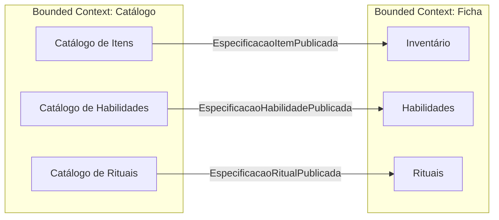

# Context Map

```mermaid
flowchart LR
    subgraph C["Bounded Context: Catálogo"]
        direction TB
        CI["Catálogo de Itens"]
        CH["Catálogo de Habilidades"]
        CR["Catálogo de Rituais"]
    end

    subgraph F["Bounded Context: Ficha"]
        direction TB
        FI["Inventário"]
        FH["Habilidades"]
        FR["Rituais"]
    end

    CI -->|"EspecificacaoItemPublicada"| FI
    CH -->|"EspecificacaoHabilidadePublicada"| FH
    CR -->|"EspecificacaoRitualPublicada"| FR
```
